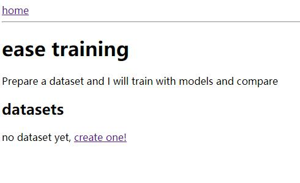
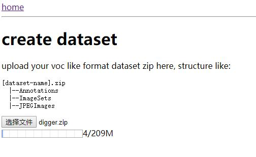
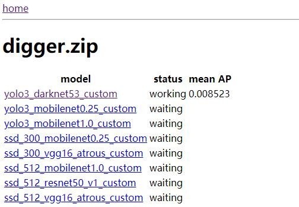
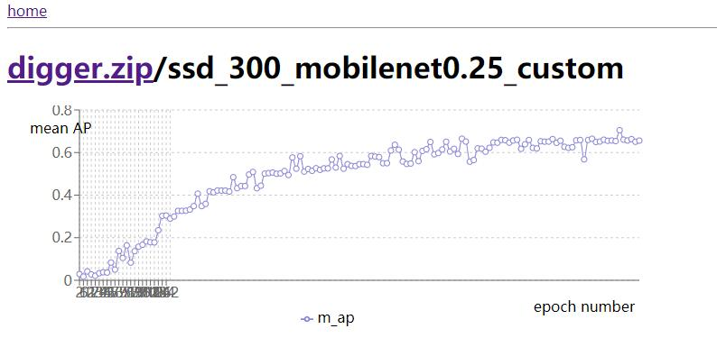

# ease training

prepare a dataset and you are ready to train, zero coding | 只要准备好训练数据集，就可以开始训练了，无需编码

## requirements | 需求

- linux
- docker
- docker-compose
- nvidia-docker


## useage | 用法

clone this project and cd project folder | 克隆本项目并 cd 到项目目录

```
./prepare.sh
docker-compose up -d
```

then open http://localhost:3000 (or replace localhost with lan IP) | 打开 http://localhost:3000 或 localhost 更换为局域网 IP


|   |   |
:-------------------------:|:-------------------------:
   |     

## use docker only | 只使用 docker

prepare your custom dataset and map to `/dataset.zip` and map out where you generate `classes.py` and parameters: | 准备数据集映射到 `/dataset.zip`，并向外映射 `classes.py` 和训练结果

```
docker run -it --rm --gpus all --shm-size=32G -v $(pwd)/parameters:/parameters -v $(pwd)/dataset.zip:/dataset.zip -v $(pwd):/out-classes postor/ease-training train_yolo3.py --gpus=0 --save-prefix=/parameters/

# or cache models and train with more params | 缓存下载的模型以及更多的训练参数
docker run -it --rm --gpus all --shm-size=32G -v ~/.mxnet:/root/.mxnet -v $(pwd)/parameters:/parameters -v $(pwd)/dataset.zip:/dataset.zip -v $(pwd):/out-classes --shm-size 32G postor/ease-training train_yolo3.py --batch-size=2 --gpus=1,2 --lr=0.0001 --epochs=500 --network=darknet53 --save-prefix=/parameters/
```
replace `train_yolo3.py --network=darknet53 --data-shape=416` with `train_${detector}.py --network=${network} --data-shape=${dataShape}` as needed, [check supported network && data shape](#supported-network--data-shape--支持的-network--data-shape)

params or logics refer https://gluon-cv.mxnet.io/build/examples_detection/index.html and [training/predict.py](./training/predict.py) | 参数及逻辑参考 https://gluon-cv.mxnet.io/build/examples_detection/index.html 和 [training/predict.py](./training/predict.py)

after training, parameters shall be in your `$(pwd)/parameters` folder | 训练之后，训练结果会产生在 `$(pwd)/parameters` 目录

to predict, you need some sample images, put them into a folder, like `$(pwd)/test`, run this to generate result to `$(pwd)/result` | 要进行预测，你需要准备些样例图片，放到一个文件夹里，比如 `$(pwd)/test`，运行以命令码将预测结果生成到 `$(pwd)/result`

```
docker run -it --rm --gpus all  -v $(pwd)/parameters:/training/parameters -v $(pwd)/test:/test -v $(pwd)/result:/result postor/ease-training --model=yolo3_darknet53 --data-shape=416 --input-folder=/test --output-folder=/result
```

replace `--model=yolo3_darknet53 --data-shape=416` with `--model=${detector}_${network} --data-shape=${dataShape}` if needed

## supported network && data shape | 支持的 network && data shape

* yolo3
    * darknet53
        * 320
        * 416
        * 608
    * mobilenet0.25
        * 320
        * 416
        * 608
    * mobilenet1.0
        * 320
        * 416
        * 608
* ssd
    * mobilenet0.25
        * 300
    * vgg16_atrous
        * 300
        * 512
    * mobilenet1.0
        * 512
    * resnet50_v1
        * 512