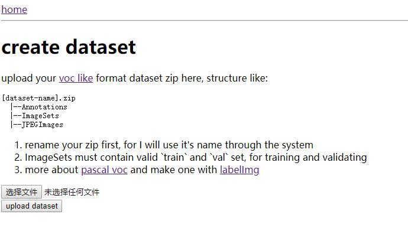

# ease training

To train at ease

I want to train my custom data and compare performance among different models, so I start this project

## features

### object detection

- [ ] load voc like dataset from zip
- [ ] train with SSD / Faster-RCNN / YOLOv3
- [ ] generate test code for image / video
- [ ] realtime mAP chart
- [ ] model zoo chart
- [ ] dataset builder

### semantic segmentation

- [ ] maybe later

## useage

```
./prepare.sh
docker-compose up -d
```

then open http://localhost:3000 (or replace localhost with lan IP)




